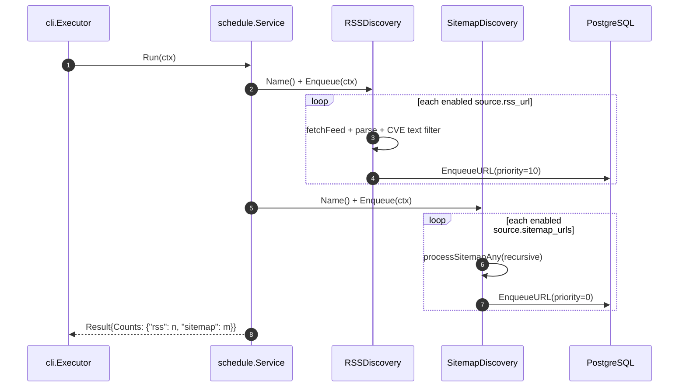
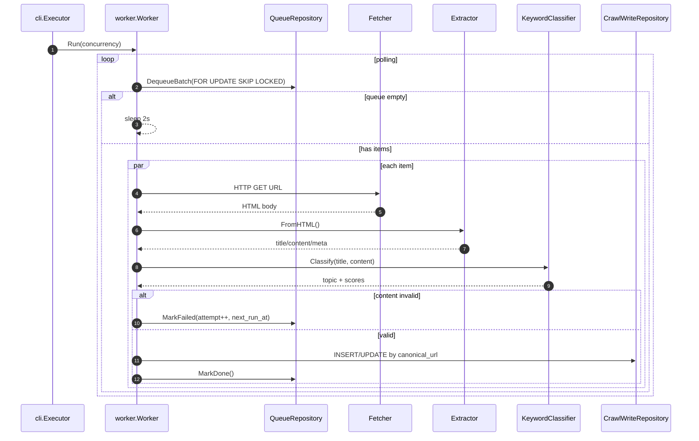
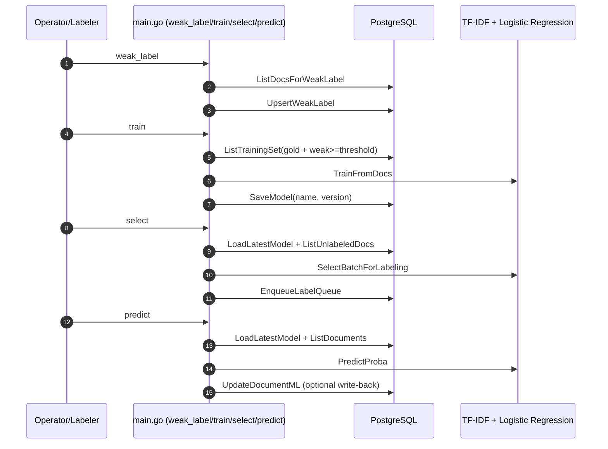

# Agent Crawl – Project Overview & Technical Design

## 1) Mục tiêu dự án
Agent Crawl là hệ thống crawl tin công nghệ/an toàn thông tin theo hướng **pipeline**, gồm 3 luồng chính:
- **Discovery**: lấy URL từ RSS/Sitemap và đưa vào hàng đợi crawl.
- **Processing**: worker tải trang, trích xuất nội dung, phân loại topic, lưu document.
- **Learning loop**: gán nhãn yếu/gold, train model TF-IDF + Logistic Regression, chọn mẫu active learning, và ghi dự đoán ML trở lại document.

Dự án áp dụng **Clean Architecture** 3 tầng (domain → application → infrastructure) để đảm bảo logic nghiệp vụ độc lập với framework và DB.

---

## 2) Bức tranh kiến trúc tổng thể

### 2.1 Các tầng kiến trúc

```
cmd/main.go
    └── application/cli        ← điều phối commands, inject dependencies
          ├── application/schedule   ← use case: orchestrate discoverers
          ├── application/worker     ← use case: crawl + classify pipeline
          ├── application/learning   ← use case: weak-label / train / select
          └── application/loader     ← load config YAML

domain/repository   ← interfaces (contracts) cho mọi tầng trên
domain/model        ← data structs thuần Go
domain/config       ← AppConfig structs

infrastructure/persistence/postgres  ← Store: implement toàn bộ repository interfaces
infrastructure/discovery             ← RSSDiscovery, SitemapDiscovery
infrastructure/classify              ← KeywordClassifier
infrastructure/fetcher               ← HTTP fetcher
infrastructure/extract               ← HTML extractor
infrastructure/machine_learning      ← package ml: TF-IDF, LogReg, active learning
```

### 2.2 Cấu trúc thư mục

```
cmd/
  main.go                          entrypoint, wire dependencies
config/
  config.yaml                      DB, HTTP, scheduler, worker, classify, sitemap
  topics.yaml                      taxonomy + keywords + weights
  sources.yaml                     danh sách nguồn RSS/Sitemap
internal/
  domain/
    config/AppConfig.go            AppConfig, Config, TopicsFile, SourcesFile
    model/                         document.go, learning.go, queue.go
    repository/repository.go       tất cả repository interfaces
  application/
    cli/service.go                 Executor + tất cả command handlers
    schedule/service.go            Discoverer interface + Service (orchestration)
    worker/service.go              Worker: dequeue → fetch → extract → persist
    learning/
      select_service.go            SelectBatchForLabeling, ComputeMargins
      train_service.go             TrainFromDocs, TrainResult
      weak_label_service.go        WeakLabeler, ApplyWeakLabels
    loader/service.go              LoadAll: nạp 3 file YAML đồng thời
  infrastructure/
    persistence/postgres/
      store.go                     Store struct, compile-time interface checks
      bootstrap.go / queue.go / documents.go / learning.go / migrate.go / connect.go
    discovery/
      rss.go                       RSSDiscovery (implements schedule.Discoverer)
      sitemap.go                   SitemapDiscovery (implements schedule.Discoverer)
      normalize.go                 URL canonicalization
      cve_filter.go                CVE pattern filter
    classify/classify.go           KeywordClassifier (rule-based)
    fetcher/fetcher.go             HTTP fetch với timeout/max-bytes
    extract/extract.go             HTML → article (title/content/author/date)
    machine_learning/              package ml – tất cả ML trong 1 package
      tfidf_vectorizer.go          Vectorizer, SparseVector, TokenizeUnigram
      logistic_regression.go       Model, NewModel, SGDStep, TrainSGD
      batch_balanced.go            SelectBatchBalanced (margin + diversity)
      model_bundle_codec.go        Bundle{Vectorizer, Model}, Marshal/Unmarshal
  platform/
    text_util.go                   tiện ích text
    timeparse_util.go              tiện ích parse time
migrations/
  001_init.up.sql
  002_learning.up.sql
  003_documents_ml.up.sql
```

### 2.3 Dependency injection

`cmd/main.go` khởi tạo `postgres.Store` duy nhất, sau đó inject vào `cli.Executor` qua các repository interfaces:

```
postgres.Store
  → BootstrapRepository  → cli.Executor.Bootstrap
  → MigrationRepository  → cli.Executor.Migrate
  → QueueRepository      → schedule.Service (via Discoverer) + worker.Worker
  → CrawlWriteRepository → worker.Worker
  → DocumentRepository   → cli.Executor.Document
  → LearningRepository   → cli.Executor.Learning
  → ModelRepository      → cli.Executor.Model
```

Application code không có import nào từ `pgx` hay bất kỳ package infrastructure nào (ngoại trừ `machine_learning` trong `application/learning`).

---

## 3) Technical design chi tiết

### 3.1 Config & bootstrap
Hệ thống nạp đồng thời 3 file YAML qua `application/loader`:
1. `config/config.yaml` (DB, HTTP, scheduler, worker, classify, sitemap)
2. `config/topics.yaml` (taxonomy + keyword + weight)
3. `config/sources.yaml` (danh sách nguồn RSS/Sitemap)

`database_url` hỗ trợ biến môi trường (`os.ExpandEnv`).

### 3.2 Discovery & Schedule design

`application/schedule.Service` định nghĩa interface `Discoverer`:
```go
type Discoverer interface {
    Name() string
    Enqueue(ctx context.Context) (int, error)
}
```

Cả `RSSDiscovery` và `SitemapDiscovery` implement interface này. `Service.Run()` gọi tuần tự từng discoverer và tổng hợp kết quả.

#### RSS discovery
- Duyệt qua source `enabled` có `rss_url`.
- Parse feed bằng `gofeed`.
- Lọc bằng `LooksLikeCVEByText(title, desc)`.
- URL được normalize trước khi enqueue.
- Enqueue với priority `10`.

#### Sitemap discovery
- Chỉ chạy khi `sitemap.enabled = true`.
- Hỗ trợ cả `sitemapindex` lẫn `urlset`.
- Giới hạn depth recursion, max child sitemap, max URLs per source.
- Lọc URL bằng `LooksLikeCVEByURL`.
- Enqueue với priority `0`.

### 3.3 Queue & worker processing

#### Queue model
`crawl_queue` dùng trạng thái enum: `pending` → `processing` → `done`.  
Lỗi thì tăng `attempts`, set `next_run_at`, quay lại `pending` hoặc `failed` nếu vượt ngưỡng.

`DequeueBatch` dùng transaction + `FOR UPDATE SKIP LOCKED` để an toàn khi nhiều worker chạy đồng thời.

#### Worker flow (`application/worker.Worker`)
- Poll queue liên tục (sleep 2s khi rỗng).
- Xử lý song song với semaphore (`concurrency` từ CLI).
- Mỗi URL:
  1. Fetch HTML
  2. Extract metadata + content text
  3. Classify bằng keyword score
  4. Quality gate: content ≥ 200 ký tự, title không rỗng
  5. Upsert vào `documents` theo `canonical_url`
  6. Mark queue done / fail

### 3.4 Extraction strategy
Extractor ưu tiên metadata standards:
- canonical: `<link rel="canonical">`, `og:url`, fallback URL gốc
- title: `og:title`, `<title>`, `<h1>`
- author: `meta[name=author]`, `article:author`
- published_time: article metadata hoặc `time[datetime]`

Content extraction ưu tiên selector phổ biến (`article`, `.post-content`, ...) rồi fallback `body`.

### 3.5 Classification strategy (rule-based)
- Chuẩn hóa text trước khi match.
- Điểm keyword trong title được nhân hệ số 3.
- Điểm keyword trong body giữ nguyên trọng số.
- Topic có điểm cao nhất thắng; thấp hơn `min_score_to_accept` thì trả `unknown`.

### 3.6 Learning + ML design

Tất cả ML nằm trong `package ml` (`infrastructure/machine_learning/`):
- **`tfidf_vectorizer.go`**: `Vectorizer.Fit()` + `Transform()` → `SparseVector` (L2-normalized).
- **`logistic_regression.go`**: `Model.TrainSGD()` với SGD + L2 regularization.
- **`batch_balanced.go`**: `SelectBatchBalanced()` – chọn mẫu theo margin uncertainty + cosine diversity.
- **`model_bundle_codec.go`**: `Bundle{Vectorizer, Model}` – marshal/unmarshal JSON.

#### Weak labeling (`application/learning`)
- Lấy docs chưa có weak label.
- Áp dụng rule để sinh `(topic, confidence, rule_id)`.
- Upsert vào `labels_weak`.

#### Training set assembly
- Ưu tiên `labels_gold`.
- Fallback `labels_weak` với `confidence >= minWeakConf`.

#### Model training
- Vectorizer: TF-IDF với `minDF` configurable.
- Classifier: multi-class logistic regression (softmax) train bằng SGD.
- Model bundle (vectorizer + weights) lưu nhị phân vào bảng `models`.

#### Active learning selection
- Load latest model.
- Predict trên tập unlabeled.
- Chọn batch theo uncertainty margin + cosine diversity.
- Ghi vào `label_queue` cho quy trình gán nhãn thủ công.

#### Prediction write-back
Command `predict` ghi ngược vào `documents.ml_*`:
- `ml_topic_id`, `ml_confidence`, `ml_scores`, `ml_model_name`, `ml_model_version`, `ml_predicted_at`.

---

## 4) Data model (PostgreSQL)

### 4.1 Core tables
- `topics`: metadata topic + keyword json.
- `sources`: metadata nguồn crawl.
- `crawl_queue`: task queue URL crawl.
- `documents`: dữ liệu bài viết đã xử lý.

### 4.2 Learning tables
- `labels_weak`: nhãn yếu theo rules.
- `labels_gold`: nhãn thật (human-labeled).
- `models`: versioned model artifact.
- `label_queue`: hàng đợi gợi ý mẫu để gán nhãn.

### 4.3 ML columns trên documents
- `ml_topic_id`, `ml_confidence`, `ml_scores`, `ml_model_name`, `ml_model_version`, `ml_predicted_at`.

---

## 5) Sequence diagrams

### 5.1 Discovery (`schedule`)


### 5.2 Worker (`worker`)


### 5.3 Learning loop


---

## 6) Feature matrix (hiện có)

- ✅ Crawl từ **RSS** và **Sitemap**.
- ✅ Lọc domain/CVE pattern trước khi enqueue.
- ✅ Queue retry với `attempts`, `backoff`, `max_attempts`.
- ✅ Extract metadata + nội dung text từ HTML.
- ✅ Classify keyword-based theo taxonomy configurable.
- ✅ Dedupe theo canonical URL và hash content.
- ✅ Learning pipeline: weak labels, gold labels, train model, select active learning, predict + write-back.
- ✅ CLI vận hành đủ vòng đời dữ liệu.

---

## 7) Non-functional design notes

- **Idempotency**: queue và documents có unique index chống trùng.
- **Concurrency safety**: dequeue dùng transaction lock + skip locked.
- **Resilience**: retry/backoff khi fetch/extract/db fail.
- **Observability**: structured logging qua `zerolog`.
- **Performance controls**:
  - HTTP timeout/max bytes
  - giới hạn enqueue theo source/sitemap
  - batch size và worker concurrency.

---

## 8) Các điểm cần cải tiến (đề xuất)

1. **Tách role service**: scheduler/worker/api thành process độc lập.
2. **Bổ sung metrics**: Prometheus (queue lag, success rate, retry rate, extraction quality).
3. **Index tuning**: thêm index theo `status, attempts, next_run_at` cho queue lớn.
4. **Content quality scoring**: lọc boilerplate tốt hơn bằng heuristic/Readability.
5. **Model serving**: endpoint inference thay vì chỉ qua CLI.
6. **Labeling UI**: web UI cho `label_queue` + audit trail.
7. **Testing**: unit/integration tests cho discovery/extract/worker/db migrations.

---

## 9) Runbook nhanh

```bash
# migrate schema + upsert topics/sources
go run ./cmd/main.go migrate --config ./config/config.yaml

# schedule URL từ RSS + sitemap
go run ./cmd/main.go schedule --config ./config/config.yaml

# chạy worker crawl + classify
go run ./cmd/main.go worker --config ./config/config.yaml --concurrency 20

# xem docs theo topic
go run ./cmd/main.go list cve 100 --config ./config/config.yaml

# huấn luyện vòng ML
go run ./cmd/main.go weak_label --config ./config/config.yaml --limit 5000
go run ./cmd/main.go train --config ./config/config.yaml --model-name tfidf_lr --classes "cve,malware,patch,threat"
go run ./cmd/main.go select --config ./config/config.yaml --batch 50 --model-name tfidf_lr
go run ./cmd/main.go predict --config ./config/config.yaml --topic all --limit 5000 --write true --model-name tfidf_lr
```


