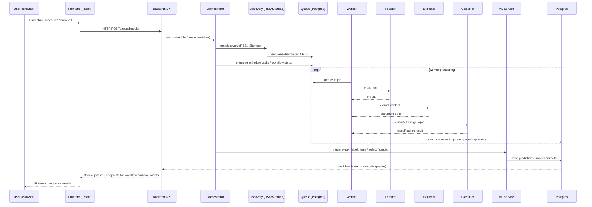

# Agent Crawl

Agent Crawl là một hệ thống thu thập và xử lý nội dung (discovery → crawl/extract → classify → learning) gồm hai thành phần chính:

- Backend (Go): API, pipeline xử lý, ML, và persistence (Postgres).
- Frontend (React + Vite): dashboard quản lý, xem kết quả và kích hoạt pipeline.

Phiên bản đầy đủ cấu trúc hiện tại của repository.

## Nhanh chóng nắm bắt

- Project root: repository chứa hai thư mục chính: `backend/` và `frontend/`.
- Backend binary entrypoint: `backend/cmd` (các command: `migrate`, `api`, `worker`, `schedule`, `train`, `select`, ...).
- Frontend dev: Vite dev server chạy trên `localhost:5173` (mặc định), proxy API tới backend.

## Cấu trúc chính

Chi tiết cấu trúc dự án (thư mục / file chính):

- `backend/`
  - `go.mod`, `go.sum`
  - `cmd/`
    - `main.go` (entrypoint CLI: `migrate`, `api`, `worker`, `schedule`, ...)
  - `config/`
    - `config.yaml`
    - `sources.yaml`
    - `topics.yaml`
  - `internal/`
    - `application/`
      - `api/`
        - `server.go`
        - `handlers.go`
        - `auth.go`
      - `cli/`
        - `service.go`
      - `learning/`
        - `select_service.go`
        - `train_service.go`
        - `weak_label_service.go`
      - `loader/`
        - `service.go`
      - `orchestrator/`
        - `orchestrator.go`
        - `step.go`
        - `steps.go`
        - `workflow.go`
        - `workflows.go`
      - `schedule/`
        - `service.go`
      - `worker/`
        - `service.go`
    - `domain/`
      - `config/`
        - `AppConfig.go`
      - `model/`
        - `dashboard.go`
        - `document.go`
        - `health.go`
        - `learning.go`
        - `queue.go`
        - `workflow.go`
      - `repository/`
        - `repository.go`
    - `infrastructure/`
      - `classify/`
        - `classify.go`
      - `discovery/`
        - `normalize.go`
        - `rss.go`
        - `sitemap.go`
        - `topic_filter/`
          - `ai_filter.go`
          - `cloud_filter.go`
          - `cve_filter.go`
          - `topic_filter.go`
      - `extract/`
        - `extract.go`
      - `fetcher/`
        - `fetcher.go`
      - `machine_learning/`
        - `batch_balanced.go`
        - `logistic_regression.go`
        - `model_bundle_codec.go`
        - `tfidf_vectorizer.go`
      - `persistence/`
        - `postgres/`
          - `bootstrap.go`
          - `connect.go`
          - `dashboard.go`
          - `db.go`
          - `documents.go`
          - `health.go`
          - `labeling.go`
          - `learning.go`
          - `migrate.go`
          - `queue.go`
          - `store.go`
          - `workflow.go`
    - `platform/`
      - `text_util.go`
      - `timeparse_util.go`
  - `migrations/`
    - `001_init.up.sql`
    - `002_learning.up.sql`
    - `003_documents_ml.up.sql`
    - `004_workflow.up.sql`
    - `005_add_simhash.up.sql`

- `frontend/`
  - `index.html`
  - `package.json`
  - `tsconfig.app.json`
  - `tsconfig.json`
  - `tsconfig.node.json`
  - `vite.config.ts`
  - `src/`
    - `App.tsx`
    - `index.css`
    - `main.tsx`
    - `vite-env.d.ts`
    - `api/`
      - `client.ts`
      - `types.ts`
    - `components/`
      - `Layout.module.css`
      - `Layout.tsx`
    - `pages/`
      - `DashboardPage.tsx`
      - `DocumentDetailPage.tsx`
      - `DocumentsPage.tsx`
      - `HealthPage.tsx`
      - `LabelingPage.tsx`
      - `Page.module.css`
      - `SourcesPage.tsx`
      - `TopicsPage.tsx`
      - `WorkflowsPage.tsx`
      - `WorkflowStepsPage.tsx`

## Quick start (Windows / PowerShell)

1) Backend (dev)

```powershell
cd backend
# Ensure required environment variables are set (e.g. API_KEY, JWT_SECRET)
go run ./cmd/main.go migrate --config ./config/config.yaml
go run ./cmd/main.go api --config ./config/config.yaml --addr :8080
```

Gợi ý: nếu môi trường có chính sách AppLocker/WDAC, build binary cố định và chạy:

```powershell
cd backend
go build -o .\bin\agent-crawl.exe ./cmd
.\bin\agent-crawl.exe api --config ./config/config.yaml --addr :8080
```

2) Frontend (dev)

```powershell
cd frontend
npm install
# Ensure frontend will send auth when needed (set VITE_API_KEY or VITE_API_BEARER_TOKEN in your env)
npm run dev
```

3) Trigger schedule (ví dụ)

```powershell
curl -X POST http://localhost:8080/api/schedule -H "X-API-Key: <your-api-key>"
```

## Những điểm quan trọng

- API write endpoints (ví dụ `/api/schedule`) yêu cầu authentication: `X-API-Key` hoặc `Authorization: Bearer <jwt>` (JWT HS256 với `auth.jwt_secret`).
- Backend lưu workflow và step execution vào DB — frontend có thể truy vấn lịch sử và log.
- ML stack hiện có: TF-IDF vectorizer + Logistic Regression; pipeline support: weak_label → train → select → predict.

## Luồng hoạt động (Sequence diagram)

Dưới đây là sequence diagram (Mermaid) mô tả luồng chính giữa frontend, backend, worker và các thành phần hạ tầng:



Ghi chú ngắn:

- `API` là điểm tiếp nhận lệnh từ `FE` và lập workflow (gọi `Orchestrator`).
- `Discovery` tạo các task enqueue vào `Queue` (Postgres); `Worker` tiêu thụ queue để fetch/extract/classify và ghi kết quả về DB.
- `Orchestrator` chịu trách nhiệm chạy các bước post-schedule: weak_label → train → select → predict (gọi `ML Service` hoặc module nội bộ).

---

