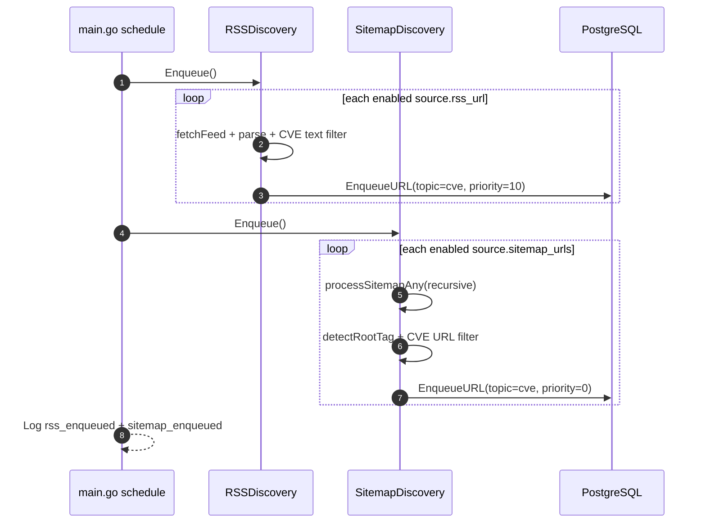
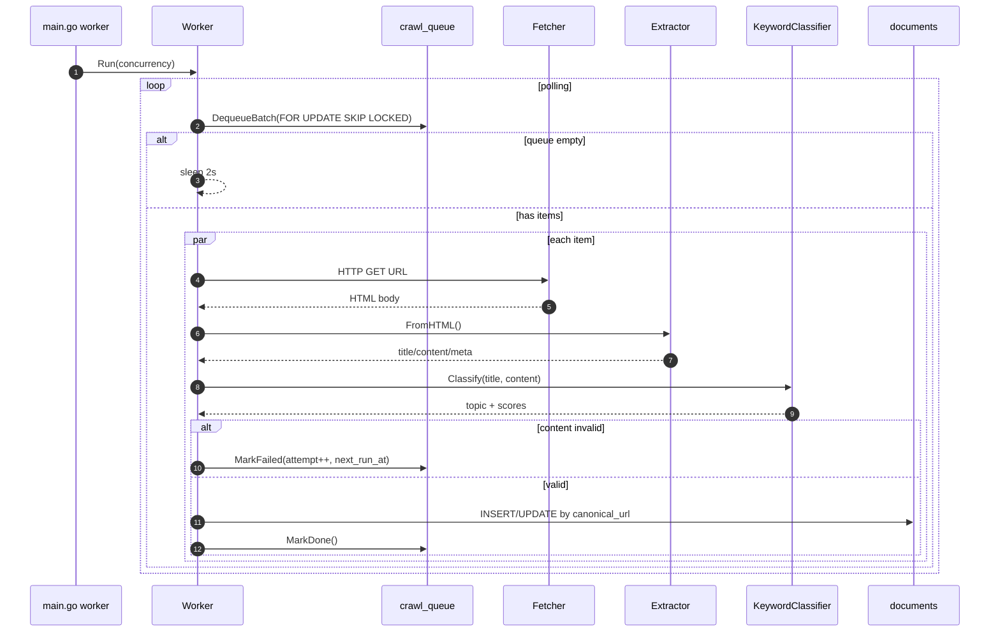
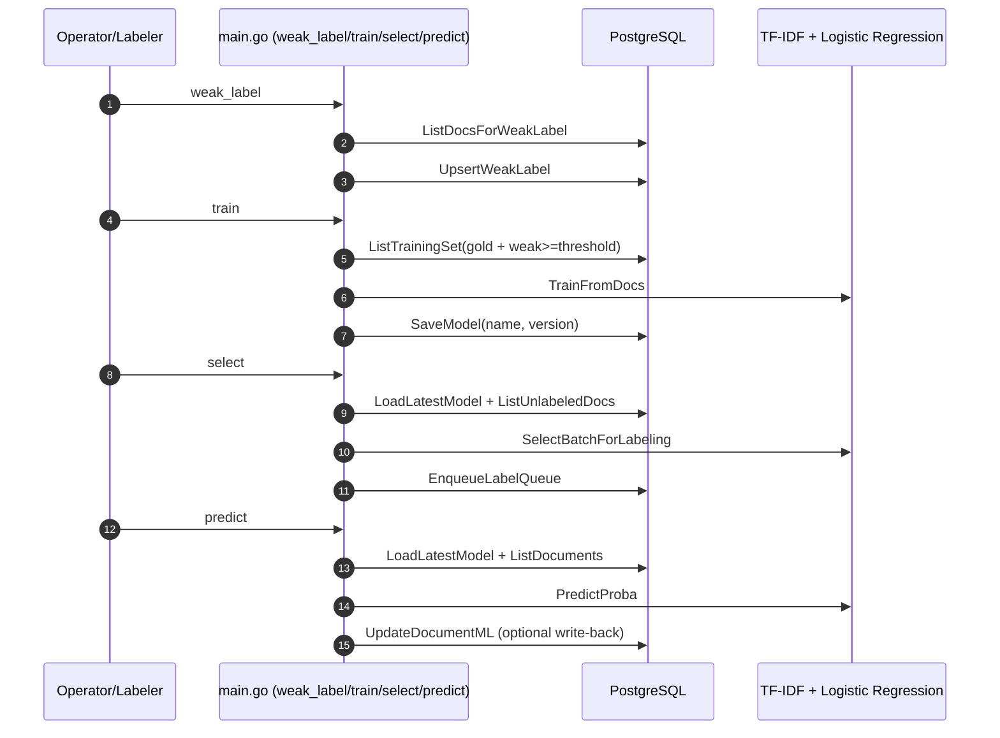

# Agent Crawl – Project Overview & Technical Design

## 1) Mục tiêu dự án
Agent Crawl là hệ thống crawl tin công nghệ/an toàn thông tin theo hướng **pipeline**, gồm 3 luồng chính:
- **Discovery**: lấy URL từ RSS/Sitemap và đưa vào hàng đợi crawl.
- **Processing**: worker tải trang, trích xuất nội dung, phân loại topic, lưu document.
- **Learning loop**: gán nhãn yếu/gold, train model TF-IDF + Logistic Regression, chọn mẫu active learning, và ghi dự đoán ML trở lại document.

Dự án được tổ chức theo hướng MVP nhưng đã có sẵn các nền tảng để mở rộng production.

---

## 2) Bức tranh kiến trúc tổng thể

### 2.1 Thành phần runtime
- **CLI entrypoint (`main.go`)**: điều phối các command (`migrate`, `schedule`, `worker`, `list`, `show`, `weak_label`, `train`, `select`, `predict`).
- **Config layer (`internal/config`)**: nạp 3 file YAML (`config.yaml`, `topics.yaml`, `sources.yaml`).
- **Discovery layer (`internal/discovery`)**:
  - RSS discovery (ưu tiên URL từ feed)
  - Sitemap discovery (backfill sâu, có giới hạn depth/child)
  - Bộ lọc CVE theo URL/text.
- **Worker layer (`internal/worker`)**:
  - dequeue task từ DB
  - fetch HTML
  - extract nội dung/tác giả/ngày/canonical
  - classify keyword-based
  - upsert vào `documents`
- **Learning/ML layer (`internal/learning`, `internal/machine_learning`)**:
  - Weak labeling rules
  - Train TF-IDF + softmax logistic regression
  - Active learning (margin + diversity)
  - Predict và ghi `ml_*` fields.
- **Persistence layer (`internal/db`)**: thao tác queue/documents/labels/models.
- **PostgreSQL**: nguồn lưu trữ chính cho queue, dữ liệu crawl, nhãn và model.

### 2.2 Cấu trúc thư mục
- `main.go`: command orchestration.
- `internal/config`: kiểu dữ liệu và loader YAML.
- `internal/discovery`: RSS/Sitemap ingestion + URL normalize + CVE filtering.
- `internal/fetcher`: HTTP fetch có timeout/user-agent/max-bytes theo config.
- `internal/extract`: parse HTML sang dữ liệu bài viết.
- `internal/classify`: keyword scoring classifier.
- `internal/worker`: vòng lặp xử lý queue.
- `internal/db`: truy cập PostgreSQL.
- `internal/learning`, `internal/machine_learning/*`: ML workflow.
- `migrations/*`: schema SQL.
- `config/*`: runtime config, topics, sources.

---

## 3) Technical design chi tiết

### 3.1 Config & bootstrap
Hệ thống nạp đồng thời:
1. `config/config.yaml` (DB, HTTP, scheduler, worker, classify, sitemap)
2. `config/topics.yaml` (taxonomy + keyword + weight)
3. `config/sources.yaml` (danh sách nguồn RSS/Sitemap)

`database_url` có thể dùng biến môi trường trong YAML (`os.ExpandEnv`).

### 3.2 Discovery design

#### RSS discovery
- Duyệt qua source `enabled` có `rss_url`.
- Parse feed bằng `gofeed`.
- Mỗi item được lọc bằng `LooksLikeCVEByText(title, desc)`.
- URL được normalize trước khi enqueue.
- Ghi vào `crawl_queue` với priority cao hơn sitemap (`10`).

#### Sitemap discovery
- Chỉ chạy khi `sitemap.enabled = true`.
- Hỗ trợ cả `sitemapindex` lẫn `urlset`.
- Có cơ chế giới hạn:
  - depth recursion <= 5
  - max child sitemap/index
  - max URLs per source mỗi run
- Filter URL bằng `LooksLikeCVEByURL` trước khi enqueue.
- Enqueue với priority thấp hơn RSS (`0`).

### 3.3 Queue & worker processing

#### Queue model
`crawl_queue` dùng trạng thái enum:
- `pending` → `processing` → `done`
- lỗi thì tăng `attempts`, set `next_run_at`, và có thể quay lại `pending` hoặc `failed` nếu quá ngưỡng.

`DequeueBatch` dùng transaction + `FOR UPDATE SKIP LOCKED` để tránh nhiều worker lấy trùng task.

#### Worker flow
- Poll queue liên tục (sleep 2s khi rỗng).
- Xử lý song song với semaphore (`concurrency` từ CLI).
- Mỗi URL:
  1. Fetch HTML
  2. Extract metadata + content text
  3. Classify bằng keyword score
  4. Quality gate: content >= 200 ký tự, title không rỗng
  5. Upsert vào `documents` theo `canonical_url`
  6. Mark queue done / fail

### 3.4 Extraction strategy
Extractor ưu tiên metadata standards:
- canonical: `<link rel="canonical">`, `og:url`, fallback URL gốc
- title: `og:title`, `<title>`, `<h1>`
- author: `meta[name=author]`, `article:author`
- published_time: article metadata hoặc `time[datetime]`

Content extraction ưu tiên selector phổ biến (`article`, `.post-content`, ...) rồi fallback `body`.

### 3.5 Classification strategy (rule-based)
- Chuẩn hóa text trước khi match.
- Điểm keyword trong title được nhân hệ số 3.
- Điểm keyword trong body giữ nguyên trọng số.
- Topic có điểm cao nhất thắng, nếu thấp hơn `min_score_to_accept` thì trả `unknown`.

### 3.6 Learning + ML design

#### Weak labeling
- Lấy docs chưa có weak label.
- Áp dụng rule để sinh `(topic, confidence, rule_id)`.
- Upsert vào `labels_weak`.

#### Training set assembly
- Ưu tiên `labels_gold`.
- Fallback `labels_weak` với `confidence >= minWeakConf`.

#### Model training
- Vectorizer: TF-IDF (`minDF` configurable trong code path).
- Classifier: multi-class logistic regression (softmax) train bằng SGD.
- Model bundle (vectorizer + weights) lưu nhị phân vào bảng `models`.

#### Active learning selection
- Load latest model.
- Predict trên tập unlabeled.
- Chọn batch theo uncertainty margin + diversity.
- Ghi vào `label_queue` cho quy trình gán nhãn thủ công.

#### Prediction write-back
Command `predict` có thể ghi ngược vào `documents.ml_*`:
- `ml_topic_id`, `ml_confidence`, `ml_scores`, `ml_model_name`, `ml_model_version`, `ml_predicted_at`.

---

## 4) Data model (PostgreSQL)

### 4.1 Core tables
- `topics`: metadata topic + keyword json.
- `sources`: metadata nguồn crawl.
- `crawl_queue`: task queue URL crawl.
- `documents`: dữ liệu bài viết đã xử lý.

### 4.2 Learning tables
- `labels_weak`: nhãn yếu theo rules.
- `labels_gold`: nhãn thật (human-labeled).
- `models`: versioned model artifact.
- `label_queue`: hàng đợi gợi ý mẫu để gán nhãn.

### 4.3 ML columns trên documents
- `ml_topic_id`, `ml_confidence`, `ml_scores`, `ml_model_name`, `ml_model_version`, `ml_predicted_at`.

---

## 5) Sequence diagrams

### 5.1 Discovery (`schedule`)


### 5.2 Worker (`worker`)


### 5.3 Learning loop


---

## 6) Feature matrix (hiện có)

- ✅ Crawl từ **RSS** và **Sitemap**.
- ✅ Lọc domain/CVE pattern trước khi enqueue.
- ✅ Queue retry với `attempts`, `backoff`, `max_attempts`.
- ✅ Extract metadata + nội dung text từ HTML.
- ✅ Classify keyword-based theo taxonomy configurable.
- ✅ Dedupe theo canonical URL và hash content.
- ✅ Learning pipeline: weak labels, gold labels, train model, select active learning, predict + write-back.
- ✅ CLI vận hành đủ vòng đời dữ liệu.

---

## 7) Non-functional design notes

- **Idempotency**: queue và documents có unique index chống trùng.
- **Concurrency safety**: dequeue dùng transaction lock + skip locked.
- **Resilience**: retry/backoff khi fetch/extract/db fail.
- **Observability**: structured logging qua `zerolog`.
- **Performance controls**:
  - HTTP timeout/max bytes
  - giới hạn enqueue theo source/sitemap
  - batch size và worker concurrency.

---

## 8) Các điểm cần cải tiến (đề xuất)

1. **Tách role service**: scheduler/worker/api thành process độc lập.
2. **Bổ sung metrics**: Prometheus (queue lag, success rate, retry rate, extraction quality).
3. **Index tuning**: thêm index theo `status, attempts, next_run_at` cho queue lớn.
4. **Content quality scoring**: lọc boilerplate tốt hơn bằng heuristic/Readability.
5. **Model serving**: endpoint inference thay vì chỉ qua CLI.
6. **Labeling UI**: web UI cho `label_queue` + audit trail.
7. **Testing**: unit/integration tests cho discovery/extract/worker/db migrations.

---

## 9) Runbook nhanh

```bash
# migrate schema + upsert topics/sources
go run main.go migrate --config ./config/config.yaml

# schedule URL từ RSS + sitemap
go run main.go schedule --config ./config/config.yaml

# chạy worker crawl + classify
go run main.go worker --config ./config/config.yaml --concurrency 20

# xem docs theo topic
go run main.go list cve 100 --config ./config/config.yaml

# huấn luyện vòng ML
go run main.go weak_label --config ./config/config.yaml --limit 5000
go run main.go train --config ./config/config.yaml --model-name tfidf_lr
go run main.go select --config ./config/config.yaml --batch 50
go run main.go predict --config ./config/config.yaml --topic all --limit 5000 --write true
```


